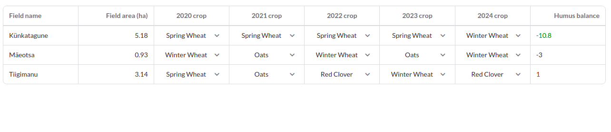

# Crop Planner Simulator
Farmer Fred is in trouble! For the last five years, he has been getting less and less corn from his fields and is 
barley making ends meet. He thinks it’s because his soil quality is rapidly declining but why?

Perhaps you can help him find out! We’re sending you his fields and crops plan, but we are missing a critical piece of 
information - the humus balance. Humus balance is a great metric of general soil health - the more humus the better! 

Please implement the humus balance calculator so Mr. Fred could start fixing his soil for the future.

## The Task!

### Show a planned humus balance for each field
Your task is to implement a simulation of how different crops might affect the field's health.
Since the calculations in real life will be very complicated, the data should be calculated
in the server and results fetched to the front-end.

How to calculate humus balance based on our data?
* Each crop has a `humus_delta` showing how it affects the field.
* Add up all the `humus_delta`s of the field's crops over the years.
* For each consecutive year the crop is on the field, multiply its effects by 1.3

#### Requirements
* Calculator is implemented in the back-end
* Humus balance is fetched at page load for all fields
* Humus balance is fetched at every crop change
* Tests pass
* No page reloads (crop changes will be lost since we're using hardcoded data in the server)
* The farmer should get visual feedback about whether he is improving or degrading his fields

#### Active Backend Changes

- Create Calculate hummus balance Route
- Create service to calculate hummus balance
- Create controller to manipulate the hummus balance

#### Active Frontend Changes

- Connect backend to fetch hummus balance and modified componentDidMount
- Display humus balance in the UI
- Display humus balance with visual feedback

#### App Screenshot

## Setting up

### Dependencies
* Ruby 3.0.0
* Yarn
* Node.js

### Back-end: Soil Service
* CD into the `soil-service` directory
* Run `bundle install`
* Make sure port `3000` is available on your machine
* Run `bundle exec rails server`

### Front-end: Crop Planner
* CD into the `crop-planner` directory
* Run `yarn install`
* Make sure port `3001` is available on your machine    
* Run `yarn start`
* Visit `localhost:3001`

### Run tests :Rails

`rpsec`

### Run tests :React

`yarn test`

# Author

👤 **Tendongze Godson**

- Email: [Email](tendongzegodson@gmail.com)
- Github: [tGodson](https://github.com/tGodson)
- Twitter: [@tendongze95](https://twitter.com/tendongze95)
- Linkedin: [tendongzegodson](https://www.linkedin.com/in/tendongzegodson)

## 🤝 Contributing

Contributions, issues and feature requests are welcome!

Feel free to check the [issues page]().

## Show your support

Give a ⭐️ if you like this project!

## Acknowledgement
[eAgronom](https://eagronom.com/en_au/)